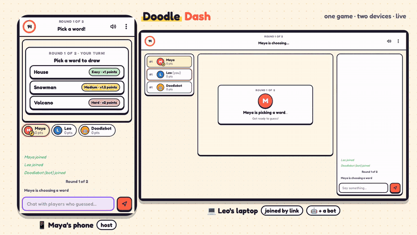
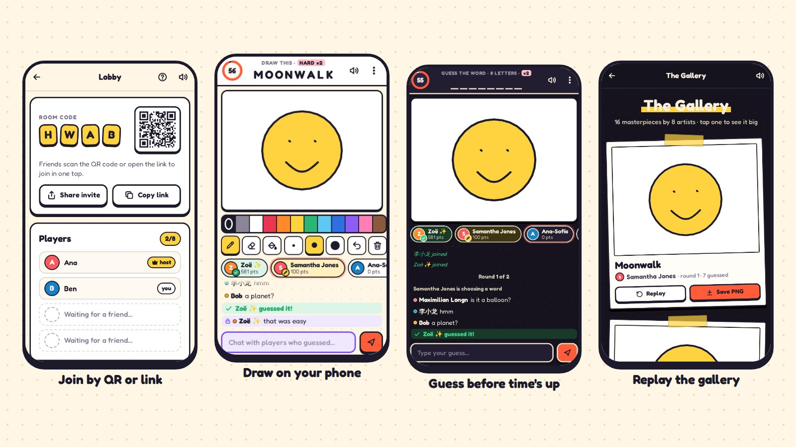
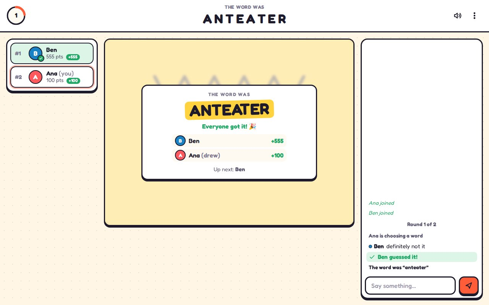
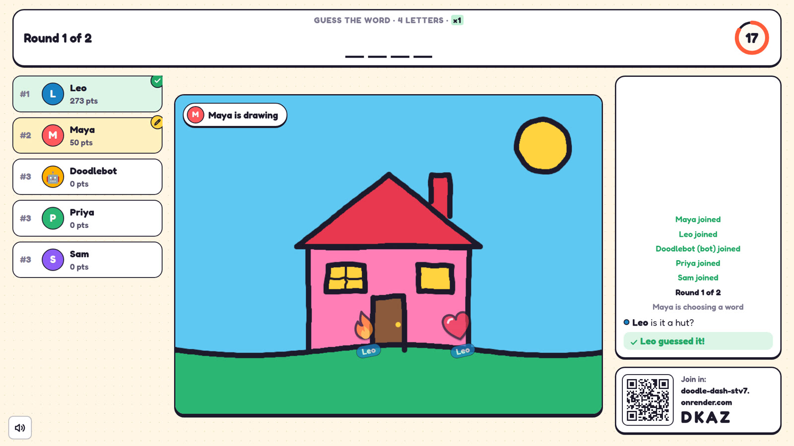
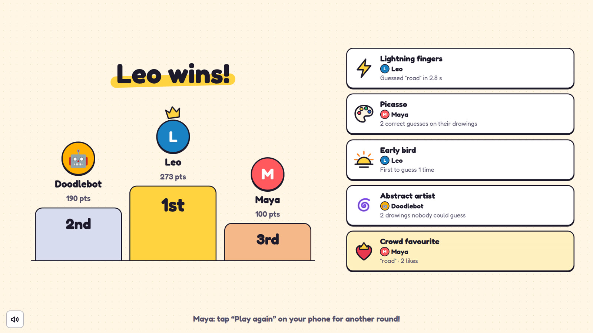

# Doodle Dash

**Draw it. Guess it. Laugh about it.** A phone-first drawing-and-guessing party game for 2–8
friends, each on their own device. Open the link, type a name, share the 4-letter room code or QR,
and play. No logins, no installs, no ads.

### ▶ Play now: **<https://doodle-dash-stv7.onrender.com>**



**[Watch the 78-second demo video](docs/doodle-dash-demo.mp4)**: a phone and a laptop play with a bot, from
creating the room to the gallery.



**What makes it different**

- **Built for phones first.** Full-width canvas, big tap targets, a toolbar that fits one hand,
  and chat that keeps the drawing in view while you type. It works on laptops too, with a
  three-column layout.
- **One-tap join.** Friends scan the QR code or open the `/r/ABCD` link and they're in.
- **Party mode on a TV.** Open `/tv` on a TV or laptop and type the room code. The big screen
  shows the QR code and who's in, then the drawing, the blanks, the timer, the scores and every
  guess, and at the end the podium and a looping slideshow of the gallery. Everyone plays on
  their own phone. The TV sees exactly what a guesser sees, so it never shows the word early.
- **Try it alone in seconds.** Tap **Add a bot** in the lobby. Bots draw hand-drawn doodles
  stroke by stroke, guess your drawing once there's something on the canvas, and chat a little.
- **Live reactions.** Tap a sticker (😂 🔥 ❤️ 😮 🤔 ⭐, drawn in the game's own style) and it
  floats up over the drawing on every screen, with your name on it.
- **Risk vs. reward.** The drawer picks an easy (×1), medium (×1.5) or hard (×2) word. Harder
  words pay more for everyone.
- **Awards and the Gallery.** The podium hands out awards: *Lightning fingers* (fastest guess),
  *Picasso* (most guesses on your drawings), *Early bird*, *So close!* and *Abstract artist*.
  Then every drawing replays stroke by stroke. Tap ♥ on your favourites to crown the *Crowd
  favourite*, watch it as a slideshow, or save one drawing (or the whole gallery as a poster)
  as a PNG to share.
- **Fair play.** The server owns the timer, the word and the scores. Guessers' browsers never
  receive the word before the reveal, and players who already guessed chat in a private
  channel so they can't spoil it.
- **Forgiving.** Refresh, lock your phone or lose signal and you have 60 seconds to come back
  to the same seat with the same score.







---

## How to play

1. **Join.** Enter a name, then create a room or type a 4-letter code. The host can show a QR
   code or share a link (`/r/ABCD`) so others join in one tap. 2–8 players.
2. **Lobby.** The host sets rounds (2–5, default 3), draw time (60 / 80 / 100 s, default 80) and a
   word pack (Everyday, Animals, Food, Places, Actions, Mixed, or Custom words). Start needs at
   least 2 players. Playing alone? The host can add bots, and they draw and guess too. The
   host can also remove a player who joined by mistake (they can't rejoin that room).
3. **Each turn.** Every player draws once per round.
   - The drawer picks 1 of 3 words (one easy, one medium, one hard) within 15 s, or gets a
     random one.
   - Guessers see only blanks `_ _ _ _ _` (spaces and hyphens are shown). One letter is revealed
     at 50 % of the draw time and another at 75 %, never more than half the letters.
   - Guessers type guesses in chat. A correct guess shows "**Ana guessed it!**" to everyone; the
     word itself is never shown. A guess one letter off gets a private "**So close!**".
   - Players who already guessed (and the drawer) chat in a private channel only they can see.
   - The turn ends when the timer runs out or everyone has guessed. The word and the points
     are then shown for 5 s.
   - Anyone can tap the smiley next to the chat to send a sticker reaction.
4. **Scoring.**
   - Guesser: `round((100 + 200 × timeLeft / drawTime) × mult)`, so 100 to 300 base points,
     and faster guesses score more.
   - Drawer: `50 × (number of correct guessers) × mult`. If nobody guesses, the drawer scores 0.
   - `mult` is the difficulty multiplier: easy ×1, medium ×1.5, hard ×2.
5. **End.** A podium for the top 3 with awards, then the Gallery: like your favourite drawings
   (not your own), play the slideshow, save PNGs or a poster. **Play again** takes everyone back
   to the lobby in the same room with scores reset.

**Playing in the same room?** Open `/tv` on a TV or laptop (or tap **Show it on a TV or laptop**
in the lobby) and type the room code. The phones stay the controllers; the TV is the show.

The same rules are in the game under **How to play** (on the home screen and in the lobby).

---

## Run it on your computer

You need [Node.js](https://nodejs.org/) 20 or newer.

```bash
git clone https://github.com/Mahesh7483/doodle-dash.git
cd doodle-dash
npm install
npm start
```

Open <http://localhost:3000>. To test with a phone, connect it to the same Wi-Fi and open
`http://YOUR-COMPUTER-IP:3000` (for example `http://192.168.1.20:3000`). You can also open a
second browser tab: each tab gets its own player.

### Tests

```bash
npm test            # unit tests, the word-leak test and a scripted 3-player socket game
npm run test:e2e    # browser test: a desktop and a phone play a full game (Playwright)
```

The first time you run the browser tests on your own machine you may need
`npx playwright install chromium`.

| Suite | What it checks |
| --- | --- |
| `test/game.test.js` | scoring and multipliers, hint schedule and the half-letters cap, guess matching and "so close", turns and rounds, early end when all guess, reconnect within 60 s, host migration, drawer disconnect, joining mid-game, room full, word packs, custom words, reactions, awards, likes, TV screens (guesser view, public chat only, no seat) and removing a player |
| `test/leak.test.js` | plays 25 randomized games (half of them with a bot, all with a TV watching) and checks that no payload sent to a guesser or the TV, including chat restored after a refresh, contains the word (or the drawer's choices) before they guess it or the reveal |
| `test/bots.test.js` | adding and removing bots, bots never hosting, a solo game against a bot played to the end (the bot draws its whole doodle and guesses only after there's ink), bots never leaking the word, every doodle is valid drawing data |
| `test/integration.test.js` | starts the real server with short timers, plays a full 3-player game over Socket.IO to the end with a TV socket watching, checks every score against the formula, repeats the leak check on what each socket (and the TV) received, and removes a player over sockets |
| `e2e/game.spec.js` | desktop host + iPhone-size guest: create, join by link and by code, draw with mouse and touch, check the pixels appear on the other screen, refresh mid-turn as guesser and as drawer, guess, reactions, podium, gallery replay and likes, Save PNG, play again; a phone playing a whole game alone against a bot; and party mode: a 1080p TV follows a 3-player game (blanks only, the drawing, reactions, podium, slideshow) while the host removes a player |

---

## Put it online with Render (free)

Render runs the game on a public URL for free. You only need a GitHub account.

1. Go to **<https://render.com>** and click **Get Started**. Choose **Sign in with GitHub** and
   allow Render to see your repositories (you can allow just `doodle-dash`).
2. In the Render dashboard, click **New** (top right), then **Blueprint**.
3. Pick the **Mahesh7483/doodle-dash** repository and click **Connect**. If it asks for a
   Blueprint name, type anything (for example `doodle-dash`).
   Render reads the `render.yaml` file in this repo, so the settings are already filled in:
   a free Node web service that runs `npm ci` to build and `npm start` to run, with a health
   check at `/healthz`.
4. Click **Deploy Blueprint** (or **Apply**). The first build takes about 2–3 minutes.
5. When the status turns **Live**, open the service. Your link is at the top of the page, like
   `https://doodle-dash.onrender.com` (Render may add a few extra letters if that name is taken).
   That's the link to share.

**Alternative (no Blueprint):** click **New**, then **Web Service**, pick the repo, and set:
Language **Node**, Build Command `npm ci`, Start Command `npm start`, Instance Type **Free**.
Under **Advanced**, set Health Check Path to `/healthz`. Then click **Create Web Service**.

Every push to the `main` branch redeploys automatically.

**Good to know about the free plan**

- The free service **goes to sleep after 15 minutes with no visitors**. The next visit wakes it
  up, which takes about **30–50 seconds**. Open the link a minute before you play.
- Rooms live in memory, so a sleep, restart or redeploy clears any open rooms. That's fine for a
  party game: just create a new room.

---

## How it works

- **Server** (`server/`): Node + Express + Socket.IO 4. `game.js` is the whole game as pure logic
  with an injectable clock (rooms, turns, timers, scoring, hints, reconnects, host migration),
  which is why it's easy to test. `index.js` wires it to HTTP and sockets and serves the QR code
  at `/qr/ABCD.svg` (rendered on the server with the `qrcode` package). `words.js` has 5 packs of
  90 words each, and `doodles.js` has the 20 doodles bots draw (simple shapes with a hand-drawn
  wobble).
- **Client** (`public/`): plain HTML, CSS and JavaScript with no build step. `canvas.js` draws on
  a fixed 800×600 canvas scaled to fit, so every screen shows the same picture; strokes are
  streamed to the other players in 40 ms chunks. `app.js` handles screens, chat and the gallery,
  `stickers.js` has the reaction stickers and award icons, and `sound.js` makes the sound
  effects in the browser (with a mute button that remembers your choice).
- **TV screen** (`public/tv.html`, `tv.js`, `tv.css`): a separate page for big screens. It joins
  a room as a *watcher*: the server sends it what a guesser sees plus the public chat, and it
  holds no seat, so it can't guess, draw or be the host.
- **Settings for testing**: `PORT` (default 3000), and `DD_DRAW_MS`, `DD_CHOOSE_MS`,
  `DD_REVEAL_MS`, `DD_DRAWER_GRACE_MS`, `DD_HOST_GRACE_MS`, `DD_SEAT_HOLD_MS` to shorten the
  timers.

```
server/   index.js (HTTP + sockets), game.js (game logic, bots), words.js (word packs), doodles.js (bot drawings)
public/   index.html, app.js, canvas.js, stickers.js, sound.js, ui.js, style.css, fonts/, icons
          tv.html, tv.js, tv.css (the TV screen)
test/     node:test unit, leak and integration tests
e2e/      Playwright browser test
```

The approved design is in [SPEC.md](SPEC.md). Font: [Fredoka](https://github.com/hafontia/Fredoka-One)
(SIL Open Font License, bundled in `public/fonts`).
